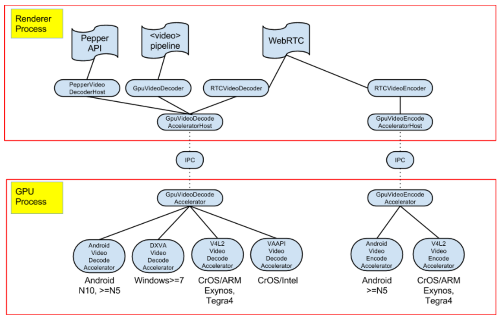

#HW Video Acceleration in Chrom{e,ium}{,OS}

Ami Fischman <fischman@chromium.org>

Status as of 2014/06/06: Up-to-date

(could use some more details)

##Introduction

Video decode (e.g. YouTube playback) and encode (e.g. video chat applications) are some of the most complex compute operations on the modern web.  Moving these operations from software running on general-purpose CPUs to dedicated hardware blocks means lower power consumption, longer battery life, higher quality (e.g. HD instead of SD), and better interactive performance as the CPU is freed up to work on everything else it needs to do. 

##Design

[media::VideoDecodeAccelerator](https://code.google.com/p/chromium/codesearch#chromium/src/media/video/video_decode_accelerator.h&q=media::VideoDecodeAccelerator&sq=package:chromium&ct=rc&cd=1&l=21&dr=Ss) (VDA) and [media::VideoEncodeAccelerator](https://code.google.com/p/chromium/codesearch#chromium/src/media/video/video_encode_accelerator.h&l=23) (VEA) (with their respective Client subclasses) are the interfaces at the center of all video HW acceleration in Chrome.  Each consumer of HW acceleration implements the relevant Client interface and calls an object of the relevant V[DE]A interface.

In general the classes that want to encode or decode video live in the renderer process (e.g. the <video> player, or WebRTC’s video encoders & decoders) and the HW being utilized is not accessible from within the renderer process, so [IPC](https://code.google.com/p/chromium/codesearch#chromium/src/content/common/gpu/gpu_messages.h&q=f:messages%5C.h%20acceleratedvideo&sq=package:chromium&type=cs&l=712) is used to bridge the renderer<->GPU process gap.

##Implementation Details

The main consumers of the acceleration APIs are: <video> pipeline (what plays media on the web), WebRTC (enabling plugin-free real-time video chat on the web), and Pepper API (offering HW acceleration to pepper plugins such as Adobe Flash).
The implementations of the acceleration APIs are specific to the OS (and sometimes HW platform) due to radically different options offered by the OS and drivers/HW present.

(not pictured: obsolete OpenMAX-IL-based [OVDA](https://code.google.com/p/chromium/issues/detail?id=223194), and never-launched [MacVDA](https://code.google.com/p/chromium/issues/detail?id=133828)).

##Current Status

New devices are released all the time so this list is likely already out of date, but as of early June 2014, existing (public) support includes:
**Decode**
- Windows: starting with Windows 7, HW accelerated decode of h.264 is used via DXVAVDA.
- CrOS/Intel (everything post-Mario/Alex/ZGB): HW accelerated decode of h.264 is used via VAVDA
- CrOS/ARM: HW accelerated decode of VP8 and h.264 is available via V4L2VDA
- Android: HW accelerated decode of VP8 is available on N10, N5, some S4’s, and a bunch of other devices.  (note that on Android this only applies to WebRTC, as there is no PPAPI and <video> uses the platform’s player)
**Encode**
- CrOS/ARM: HW accelerated encode of h.264 (everywhere) and VP8 (2014 devices) is available via V4L2VEA
- Android: HW accelerated encode of VP8 is available on N5.

##Results
Generally speaking offloading encode or decode from CPU to specialized HW has shown an overall battery-life extension of 10-25% depending on the platform, workload, etc.  For some data examples see:
public:  [133827#c27](http://crbug.com/133827#c27), [219957#c16](https://code.google.com/p/chromium/issues/detail?id=219957#c16)
google-internal only: [summary slide deck](http://docs/presentation/d/1lhWy_gsAhDtnB5l3i2ND2rWhHgmgtV394WoVzlqevAE/edit#slide=id.g1c7d5a5cf_023), [CrOS/ARM-1](https://docs.google.com/a/google.com/spreadsheets/d/1tdAEvCVPKH6280EArYPHaE10HA0iFP0aypJGy4n26LM/edit#gid=0), [CrOS/ARM-2](http://docs/document/d/1fty8UzlwN0SzJlURfNbPysYZ1sj4VFaDpF0MV95HbNE/edit#)

