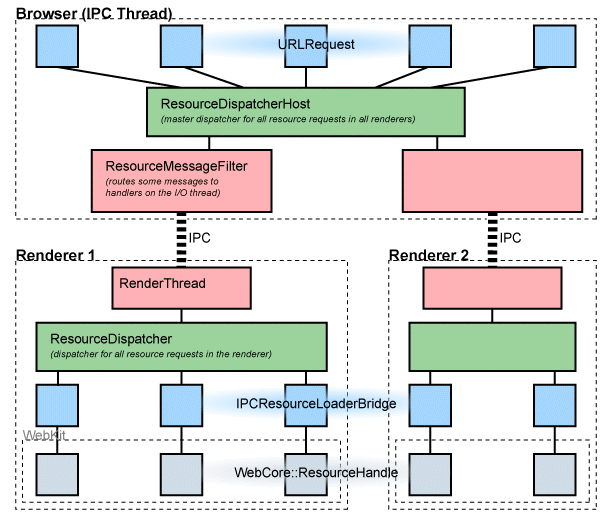

#多进程资源加载（需要更新）

##背景知识

所有网络交流都是在主浏览器进程处理的。这样浏览器进程不仅可以控制每个渲染器的网络访问，还可以在进程间维持session状态一致性，像cookie和缓存数据。另一个重要的原因是，作为一个HTTP/1.1的用户代理，浏览器整体上在每个host上不能打开太多连接。

##概述

我们的多进程应用程序可以从三个层面来看。在最底层是WebKit库，用来渲染页面。在它上面是渲染器进程（简单地，每个标签页对应一个进程），每个进程包含一个WebKit实例。管理所有渲染器的是浏览器进程，控制所有的网络访问。

##Blink（刷新器）

Blink有一个ResourceLoader对象，负责获取数据。每个加载器有一个WebURLLoader以展现真实的请求。这个实例的头文件在Blink仓库中。

ResourceLoader实现了WebURLLoaderClient接口。这是渲染器使用的回调接口，用以获取数据和其他刷新用的事件。

测试shell使用一个不同的资源加载器，提供了不同的实现，即，一个非IPC版本的ResourceLoaderBridge，位于webkit/tools/test_shell/simple_resource_loader_bridge。

##渲染器

渲染器对WebURLLoader的实现，成为WebURLLoaderImplementation，位于content/child。它使用全局的ResourceDispatcher单例对象（每个渲染器内部单例），来创建一个唯一的request ID，通过IPC转发这个request给浏览器。浏览器的响应会引用这个request ID，将其转换后，通过资源分发起返回给RequestPeer对象（WebURLRequestImpl）。

##Browser

The RenderProcessHost objects inside the browser receive the IPC requests from each renderer. It forwards these requests to the global ResourceDispatcherHost, using a pointer to the render process host (specifically, an implementation of ResourceDispatcherHost::Receiver) and the request ID generated by the renderer to uniquely identify the request.

Each request is then converted into a URLRequest object, which in turn forwards it to it's internal URLRequestJob that implements the specific protocol desired. When the URLRequest generates notifications, its ResourceDispatcherHost::Receiver and request ID are used to send the notification to the correct RenderProcessHost for sending back to the renderer. Since the ID generated by the renderer is preserved, it is able to correlate all responses with a specific request first generated by WebKit.

##Cookies

All cookies are handled by our CookieMonster object in /net/base. We do not share cookies with WinInet. The cookie monster lives in the browser process which handles all network requests because cookies need to be the same across all tabs.

Pages can request cookies for a document via document.cookie. When this occurs, we send a synchronous message from the renderer to the browser requesting the cookie. While the browser is processing the cookie, the thread that WebKit works on is suspended. When the renderer's I/O thread receives the response from the browser, it un-suspends the thread and passes the result back to the JavaScript engine.