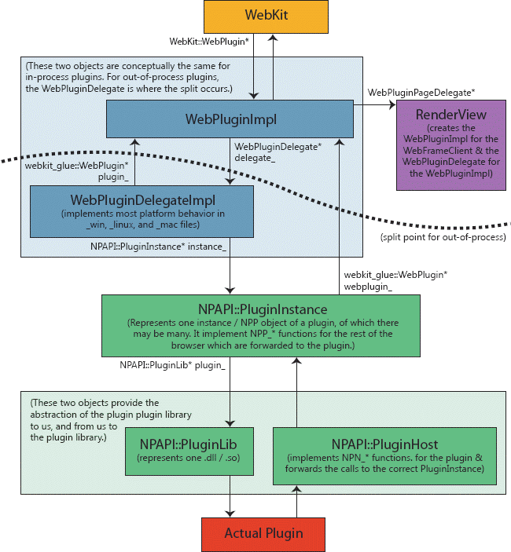
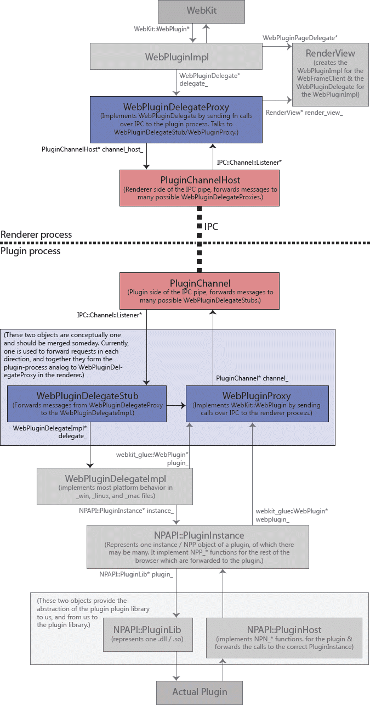

#插件架构
##背景
在阅读这个文档前，你应当熟悉Chromium的多进程架构。

##概述

插件是浏览器不稳定的主要来源。插件也会在渲染器没有实际运行时，让进程沙箱化。因为进程是第三方编写的，我们无法控制他们对操作系统的访问。解决方案是，让插件在各自独立的进程中运行。

##设计细节

###进程内插件

Chromium有着在进程内运行插件的能力（对测试来讲非常方便），也可以在进程外运行插件。它们都始于我们的非多进程WebKit嵌入层，期待嵌入层实现WebKit::WebPlugin接口。这实际由WebPluginImpl实现。WebPluginImpl在图中的虚线以上，与WebPluginDelegate接口交流，对进程内插件而言，这个接口由WebPluginDelegateImpl实现，它会接着与我们的NPAPI包装层通信。

历史经验：还没有WebKit嵌入层的时候，WebPluginImpl是对应的嵌入层。它会与“嵌入应用程序”通过WebPluginDelegate抽象接口交流，我们通过切换这个接口的实现，服务与进程内插件与进程外插件。在有了额外的Chromium WebKit API之后，我们增加了新的WebKit::WebPlugin抽象接口，它与旧的WebPluginDelegate接口有着相同的功能。这个接口的一个好一点的设计是，合并WebPluginImpl和WebPluginDelegateImpl，在WebKit::WebPlugin层做进程划分。由于这个问题的复杂性，现在还没有这样实现。

###进程外插件

Chromium通过切换上面的图中，虚线以上几层的实现来支持跨进程插件。这干预了WebPluginImpl层和WebPluginDelegateImpl之间的IPC层，并让我们在每个模式之间共享我们所有的NPAPI代码。所有旧的WebPluginDelegateImpl代码，以及与它通信的NPAPI层，现在是在独立的插件进程中执行了。

渲染器/插件通信通道的两端分别由PluginChannel和PluginChannelHost代表。我们有许多渲染器进程，以及每个插件唯一的一个插件进程。这意味着渲染器中，对于每种它所使用的插件都持有一个PluginChannelHost对象（例如，Adobe Flash和Windows Media Player）。在每个插件进程中，每个渲染器进程会有一个PluginChannel，它们各自持有一个那种插件的实例。

接着，channel的每个端点，对应许多不同的插件实例。例如，如果网页中嵌有两个Adobe Flash视频，渲染器端就会有两个WebPluginDelegateProxies对象（以及相关的成员），插件端就会有两个WebPluginDelegateStubs（以及相关的成员）。channel用一个IPC连接管理这些对象直接复数的通信。

在这个图中，你可以看到上面的进程内图表的类（用灰色表示），以及中间彩色的新的进程外代码层。

**历史经验**：我们曾经考虑使用一个stub(存根)/proxy(代理)模型进行通信，每个IPC通道的端点有一个stub和一个proxy，分别接收和发送消息给对应的插件。这会导致许多类变得迷乱。因此，WebPluginStub被合并到WebPluginDelegateProxy，现在它处理渲染器端与一个插件实例的所有IPC通信。插件端还没有合并，还剩两个类WebPluginDelegateStub和WebPluginProxy,概念上他们是相同的对象，只是代表了通信的不同方向。

###无窗口插件

无窗口插件设计用于在渲染器管道内直接运行。当WebKit想要在屏幕上绘制一个区域时，调用插件代码，将它作为一个绘制上下文处理。无窗口插件通常用在希望插件在网页上透明的情况 -- 这取决于插件绘制代码，以决定它如何导航给定的网页。

为了将无窗口插件抽出进程，你仍然需要在同步的WebKit渲染端合并他们的渲染。一个简单但低速的方法是切掉插件将要绘制的区域，然后同步地切到插件进程让它绘制。这可以由一些共享内存的方式来加速。

然而，渲染速度取决于插件进程（想象有着30个透明插件的页面，我们需要30轮插件进程的旅行）。所以，相反地，我们异步绘制无窗口插件，更像我们已有的页面是关于screen异步那样。渲染器有一个高效的回退存储，存储插件的渲染区域的图像，并使用这个图像来绘制，这样插件就可以异步发送新的代表更改渲染区域的更新。

所有的这些在透明插件上都有点复杂。这个插件进程需要知道它想要绘制的是哪些像素。所以它也要缓存渲染器最后发给它的东西，作为插件后面的页面背景，然后让插件反复地绘制这个区域。

因此，总的来说，无窗口插件绘制的区域会调用几个buffer。

渲染器进程
- 回退存储插件最后绘制的东西
- 插件的共享内存，以接收更新（“透明的DIB”）
- 复制插件背后的页面背景（在下面有描述）

插件进程
- 复制插件背后的页面背景，作为绘制时的源材料使用
- 渲染器共享内存以发送更新（“透明的DIB”）

渲染器为什么要保存页面背景的副本呢？因为如果页面背景改变了，我们需要同步地让插件重新绘制新的即将出现的背景。我们可以通过比较新绘制的背景和我们的插件存储的背景副本来判断背景的改变。因为插件和渲染器进程相互之间是异步的，他们需要独立的副本。

###系统全貌

这个图片展示了整个系统，有浏览器和两个渲染进程，它们都与一个共享的进程外Flash进程交流。总共有三个插件实例。注意这个图表有一部分是过期的，WebPluginStub已经合并到WebPluginDelegateProxy中了。
This image shows the overall system with the browser and two renderer processes, each communicating with one shared out-of-process Flash process. There are three total plugin instances. Note that this diagram is out of date, and WebPluginStub has been merged with WebPluginDelegateProxy.

