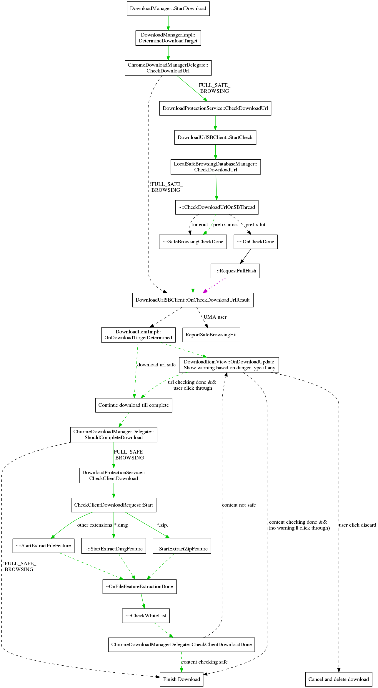
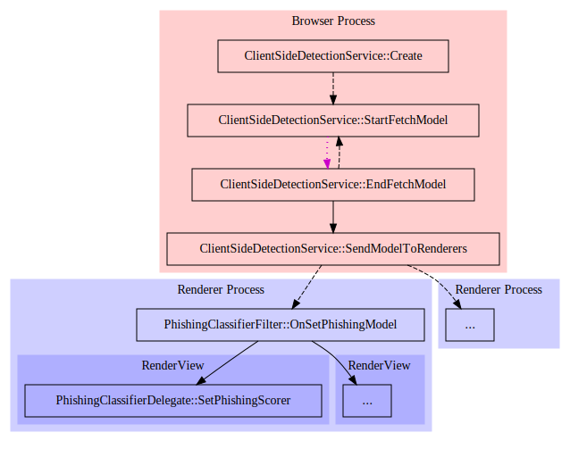
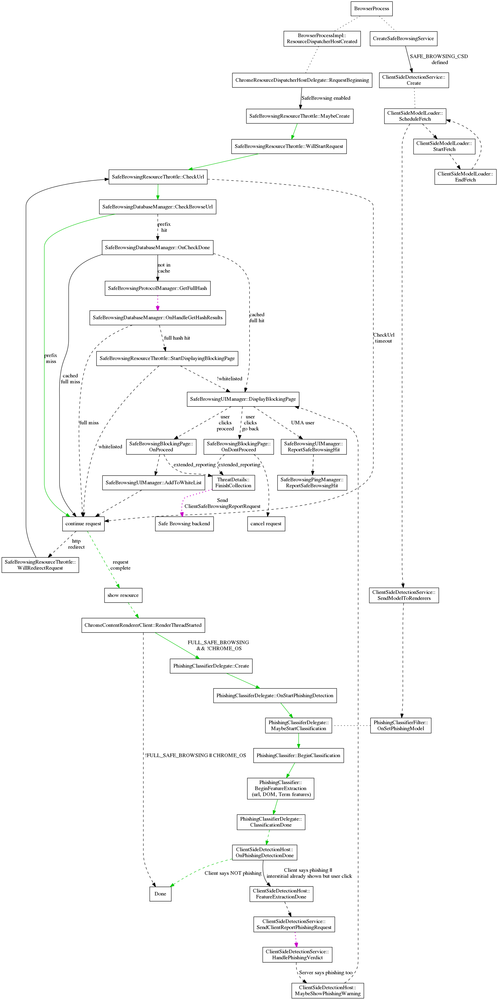

#安全浏览

##浏览保护

启动安全浏览后，在允许内容开始加载前，所有的URL都会被检查。URL通过两个列表进行检查：恶意软件和钓鱼网站。根据匹配到的列表，我们会在一个中转页面显示不同的警告页面。

检查安全浏览数据库是一个多步骤的过程。
- URL首先会被哈希，然后会用内存中前缀列表进行同步的检查。
- 如果前缀得到匹配，会向安全浏览服务器发起一个异步请求，拉取这个前缀的全量哈希列表。
- 一旦这个列表返回，完整的哈希会与列表中的每项进行比较，URL请求可以继续执行或者终止。
- 如果想要知道更多内容，你可以查看安全浏览协议的完整描述。

###资源处理器

当一个资源被请求时，ResourceDispatcherHost会创建一串的ResourceHandlers。对于加载资源时的每个事件，每个处理器可以选择取消请求，延迟请求（在决定要做的事情前，做一些异步工作），或者继续（让处理链中下一个处理器做决策）。SafeBrowsingResourceHandler在链的头部创建，所以它对于是否允许加载资源有着优先权。如果安全浏览被关闭，SafeBrowsingResourceHandler就不加入链中，因此没有浏览相关的安全浏览动作会发生。

###Safe Browsing Interstitial Page

When a resource is marked as unsafe the resource request is paused and an interstitial page (SafeBrowsingBlockingPage) is displayed. The user can choose to continue anyway, which will resume the resource request, or to go back, which will cancel the resource request and return to the previous page. 

###Threat Details Collection

If the interstitial is for a hit in the threat list (including malware, phishing, and UwS), the page is http (not https), and the tab is not in an incognito window, there is an opt-in option to send extra details about the the unsafe resources for further analysis.

When the interstitial appears an IPC is sent to the renderer process to collect details from the DOM. The data consists of a tree of the URLs for the various frames, iframes, scripts and embeds.

If the checkbox is checked when the user chooses dismisses the interstitial page, various extra details will be collected asynchronously on the browser side. First the History service is queried to get the list of redirects involved in all the URLs, then the Cache is queried to get the headers for each of the requests for those URLs, and finally the report will be sent.
##Download Protection

###URL Checking

The download checks operate in a similar manner to the browsing ones, though with some changes due to the different nature of downloads.  It is not known that a resource request will be a download until the headers are received, therefore all downloads also go through the browsing checks.  For the same reason, we cannot check the redirect URLs as we go along like is done in the browsing tests.  Instead the chain of redirects is saved in the URLRequest object and once we begin the download checks, all the URLs in the chain will be checked simultaneously.  Since downloads are less latency sensitive than page loads, we also dispense with the in-memory database and the caching of full hash results.  Finally, the check is done in parallel to the download rather than pausing the download request until the checks are done, however the file will be given a temporary name until the checks complete.
If a download is flagged as malicious, the item in the download bar will be replaced with a warning and buttons to keep or discard the file.  If discard is chosen, the request will be cancelled and the file deleted. If the file is kept, it will be renamed to its actual name (with .crdownload if the download is still in progress). 

###Hash Checking

As the file downloads, we also compute a hash of the file data.  Once the file has completed downloading this hash is checked against the download digest list.  Currently we are evaluating the usefulness of the hash check so no UI is displayed.

This is an overview of the code flow of handling a download.  Some details are omitted to keep the size reasonable. This is an overview of the code flow of handling a request.  Some details are omitted to keep the size reasonable.  The green line indicates the common case where loading a non-malware page only requires a synchronous check to the in-memory safe browsing database.  The dashed lines indicate asynchronous calls.  The dotted magenta lines indicates a request to Google's Safe Browsing server.

##Client Side Phishing Detection

Client Side Phishing Detection runs a detection model on pages the user visits to try to detect phishing pages that are not in the safe browsing lists.  On startup, and periodically afterwards, the ClientSideDetectionService will fetch an updated model.  The model is sent in an IPC to every Render Process, then assigned to PhishingClassifierDelegate associated with each RenderView.   This allows the classification to be done in the render process, which has access to the page text.

##Resource Request Flow

This is an overview of the code flow of handling a request.  Some details are omitted to keep the size reasonable.  The green line indicates the common case where loading a non-malware page only requires a synchronous check to the in-memory safe browsing database.  The dashed lines indicate asynchronous calls.  The dotted magenta lines indicates a request to Google's Safe Browsing server.

Safe Browsing Resource Request Diagram

##Metrics

Safe browsing histograms use the "SB2." prefix.  Histograms for older versions used "SB.".  There are also a few safe browsing UserMetrics (filter on "SB"), and safe browsing Rappor metrics (starts with "interstitial").

##Safe Browsing Database

The SafeBrowsingService is responsible for updating the various databases used by safe browsing.
TODO(mattm): provide more details about database format and update process.