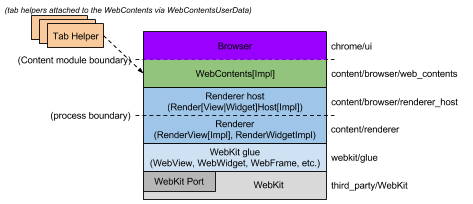
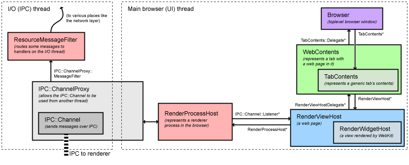

#Chromium如何展示网页

这个文档从底层描述了Chromium是如何展示网页的。请确认你已经读过[多进程架构](Multi-process_Architecture.md)这篇文章。你会特别想要了解主要组件的框架。你也可能对[多进程资源加载](General_Architecture/Multi-process_Resource_Loading.md)感兴趣，以了解网页是如何从网络中获取到的。

##应用概念层

(关于这个阐述的原始Google文档是http://goo.gl/MsEJX，开放给所有@chromium.org的人编辑)

每个矩形代表了一个应用概念层，每一层都不了解上一层，也对上一层没有依赖。

- WebKit：Safari，Chromium和其他所有基于WebKit的浏览器共享的渲染引擎。WebKit Port是WebKit的一个部分，用来集成平台独立的系统服务，比如资源加载与图像。

- Glue：将WebKit的类型转为Chromium的类型。这就是我们的“WebKit嵌入层”。这是两个browser，Chromium，和test_shell（允许我们测试WebKit）的基础。

- Renderer / Render host： 这是Chromium的“多进程嵌入层”。它代理通知，并跨过进程边界执行指令。

- WebContents：一个可重用的组件，是内容模块的主类。它易于嵌入，允许多进程将HTML绘制成View。查看[content module pages](Other/content_module___content_API.md)以获得更多信息。

- Browser: 代表浏览器窗口，包含多个WebContent。

- Tab Helpers：可以被绑定到WebContent的独立对象（通过WebContentsUserData混杂）。浏览器将这些独立对象中的一种绑定到WebContent给它持有，一个给网站图标，一个给信息栏，等等。

##WebKit

我们使用WebKit开源工程来布局web页面。这部分代码是从Apple中pull过来的，存储在/third_party/WebKit目录。WebKit主要由“WebCore”组成，这代表了核心的布局功能，还有“JavaScriptCore”，这被用来运行JavaScript。我们只在测试时运行JavaScriptCore，通常情况下，我们用我们自己高性能的V8 Javascript引擎来代替它。事实上，我们不完全是使用Apple称之为“WebKit”的那一层，这是WebCore和OS X应用程序（比如Safari）之间的嵌入API。为了方便，我们通常把从Apple学到的代码称为“WebKit”。

###The WebKit port

在最低层，我们有我们的WebKit “port”。这是我们对于需要的平台相关功能的实现，它们与平台无关的WebCore代码交互。这些文件在WebKit树上，通常在chromium目录，或以Chromium为后缀的文件中。我们的port中的大部分其实是与操作系统无关的：你可以把它认为WebCore的“Chromium port”。但某些方面，比如字体渲染，必须在不同平台上做不同的处理。

- 网络交流由我们的[多进程资源加载](General_Architecture/Multi-process_Resource_Loading.md)系统处理，而非直接从渲染线程跳到操作系统处理
- 图像使用了为Android开发的Skia图形库。这是一个跨平台的图形库，处理所有的图形和图像，除了文本。Skia在/third_party/skia里。图形操作的主要入口是/webkit/port/platform/graphics/GraphicsContextSkia.cpp。它在这个目录里，使用了许多其他的文件，还有那些/base/gfx里的文件。

###The WebKit glue（胶水）

Chromium应用程序使用不同的类型，编码风格，以及代码布局和第三方的WebKit代码。WebKit胶水使用Google编码传统与类型为WebKit提供了一个更加方便的嵌入式API（例如，我们使用std::string而非WebCore::String，使用GURL而非KURL）。胶水代码位于/webkit/glue。glue对象通常有与WebKit对象相似的命名，但在开头有Web前缀。例如， WebCore::Frame变成了WebFrame。

WebKit胶水层将Chromium代码的其他部分与WebCore数据类型隔离开，以帮助减少WebCore的改变对Chromium代码基础的影响。因此，WebCore数据类型从不直接被Chromium使用。为了Chromium的便利，需要碰一些WebCore对象时，会把API加入WebKit的胶水层。

test shell应用程序是一个为测试我们的WebKit port和胶水代码的裸web浏览器。它在与WebKit交流时，像Chromium那样使用一样的胶水接口。它为开发者提供了简单的方式去测试新的代码，而不用理会许多复杂的浏览器特性，线程和进程。这个应用程序也被用于运行自动化WebKit测试。然而，test shell的缺点在于，它不像Chromium那样用多进程方式实践WebKit。内容模块嵌入在一个被称为“content shell”的应用程序，它很快就能用于测试工作。

##渲染器进程

Chromium的浏览器进程使用胶水接口嵌入在我们的WebKit port中，它不包含很多代码：它的工作主要是作为渲染器端到浏览器的[IPC](General_Architecture)通道。渲染器中最重要的类是RenderView，位于/content/renderer/render_view_impl.cc。这个对象代表一个web页面。它处理与浏览器之间所有导航相关的命令。它驱动RenderWidget提供绘图和输入事件处理。

RenderView与浏览器进程通过全局（每个渲染器进程）RenderProcess对象与浏览器进程交流。

**FAQ:RenderWidget和RenderViewHost之间的区别在哪里？**RenderWidget通过在胶水层实现抽象接口（称为WebWidgetDelegate）映射到一个WebCore::Widget对象。基本一个屏幕上的window接收输入事件和我们画进去的东西。一个RenderView继承自RenderWidget，并且是一个标签页或一个填出窗口的内容。除了绘制与组件输入事件外，它还处理导航指令。只有一种情况下，RenderWidget可以在没有RenderView时存在，就是网页中的下拉选择框（select box）。下拉选择框必须用native window来渲染，这样他们可以在任何其他空间上方出现，并在必要时弹出。这些window需要绘制和接受输入，但他们没有独立的web页面（RenderView）。

###渲染器中的线程

每个渲染器有两个线程（查看[多进程架构](Multi-process_Architecture.md)页面来查看图表，或者[threading in Chromium](General_Architecture/Threading.md)来理解如何用它们编程）。渲染线程是主要的对象，比如RenderView和所有的WebKit代码运行的地方。当它与浏览器交流时，消息一开始发送到主线程，主线程轮流分发消息给浏览器进程。在其他情况里，这允许我们从渲染器同步发送消息到浏览器。当一个来自浏览器的结果是用于后续操作时，这可以用于小量的操作。一个例子是，JavaScript从网页请求cookie。渲染器线程会阻塞，主线程会让所有的接收到的消息排队，直到得到正确的响应。此时任何接收到的消息会突然发送给渲染器线程以执行普通的处理。

##浏览器进程

###底层浏览器进程对象

所有的与渲染器进程交流的[IPC](General_Architecture)是在浏览器的I/O线程完成的。这个线程也处理所有的[网络交流](Multi-process_Resource_Loading.md),使得它不受用户界面的干扰。

当一个RenderProcessHost对象在主线程完成初始化（当用户界面运行时），它会创造新的渲染器进程和一个通道代理[IPC](General_Architecture)对象（有一个命名了的管道通向渲染器），自动转发所有的消息回给UI线程的RenderProcessHost。一个ResourceMessageFilter会安装在这个通道，它会过滤我们指定的消息，以直接在I/O线程处理（比如网络请求）。这个过滤器发生在ResourceMessageFilter::OnMessageReceived里。

UI线程中的RenderProcessHost负责分发所有view相关消息给合适的RenderViewHost（它自己处理有限数量的与View相关的消息）。这种分发发生在RenderProcessHost::OnMessageReceived。

###上层浏览器进程对象

View相关消息出现在RenderViewHost::OnMessageReceived。这里处理的大部分消息，剩下的部分转发给RenderWidgetHost基类。这两个对象在渲染器里里映射到RenderView和RenderWidget（查看上面的“渲染器进程”来理解它们的含义）。每个平台有一个view类(RenderWidgetHostView[Aura|Gtk|Mac|Win])以集成到native view系统。

在RenderView/Widget上面是WebContents对象，大部分的消息事实上结束于这个对象的函数调用。一个WebContent代表网页的内容。它是内容模块的顶层对象，并且负责在一个矩形的view中展示网页。查看[内容模块页面](Other/content_module___content_API.md)获取更多信息。

WebContents对象包含在一个TabContentsWrapper中，它位于chrome/。负责标签页。

##说明样例

额外的例子（包含了导航和启动相关代码）在[Getting Around the Chromium Source Code](https://www.chromium.org/developers/how-tos/getting-around-the-chrome-source-code)里。

###“设置光标”消息的生命周期

设置光标是一个渲染器发往浏览器的典型消息的例子。在渲染器端，以下是发生的事情：

- 设置光标消息由WebKit内部生成，通常是作为输入事件的响应。设置光标消息开始于 content/renderer/render_widget.cc中的RenderWidget::SetCursor。

- 它会调用RenderWidget::Send来分发消息。这个方法也用于RenderView向browser分发消息。它会调用 RenderThread::Send.

- 这会调用IPC::SyncChannel，它在内部代理消息到渲染器的主线程，并将其发送给命名的管道以发送给浏览器。

然后浏览器获得了控制权：

- RenderProcessHost中的IPC::ChannelProxy通过浏览器的I/O线程接收所有的消息。它首先把他们通过ResourceMessageFilter（它在I/O线程上直接分发网络请求与相关的消息）发送出去。由于我们的消息没有被过滤掉，它继续发送到浏览器的UI线程（IPC::ChannelProxy在内部完成这个事情）。
  
  content/browser/renderer_host/render_process_host_impl.cc中的RenderProcessHost::OnMessageReceived为所有的View在对应的渲染进程获取消息。它直接处理几种消息，并把剩下的部分转发到合适的与发送消息的源RenderView对应的RenderViewHost。
  
  消息到达content/browser/renderer_host/render_view_host_impl.cc中的RenderViewHost::OnMessageReceived。许多消息是在这里处理的，但我们这时的消息不是，因为它是一个从RenderWidget来，由RenderWidgetHost处理的消息。

  RenderViewHost中所有未处理的消息自动转发给了RenderWidgetHost，包括我们的设置光标消息。

  这个映射到content/browser/renderer_host/render_view_host_impl.cc的消息最终在RenderWidgetHost::OnMsgSetCursor接收到消息，并调用合适的UI函数来设置鼠标的光标。

###“鼠标点击”消息的生命周期

发送一个鼠标点击是一个经典的浏览器到渲染器的例子。

  Windows消息在浏览器的UI线程被RenderWidgetHostViewWin::OnMouseEvent接收，
- The Windows message is received on the UI thread of the browser by RenderWidgetHostViewWin::OnMouseEvent which then calls ForwardMouseEventToRenderer in the same class.

- The forwarder function packages the input event into a cross-platform WebMouseEvent and ends up sending it to the RenderWidgetHost it is associated with.

- RenderWidgetHost::ForwardInputEvent creates an IPC message ViewMsg_HandleInputEvent, serializes the WebInputEvent to it, and calls RenderWidgetHost::Send.

- This just forwards to the owning RenderProcessHost::Send function, which in turn gives the message to the IPC::ChannelProxy.

- Internally, the IPC::ChannelProxy will proxy the message to the I/O thread of the browser and write it to the named pipe of the corresponding renderer.

Note that many other types of messages are created in the WebContents, especially navigational ones. These follow a similar path from the WebContents to the RenderViewHost.

Then the renderer takes control:

- IPC::Channel on the main thread of the renderer reads the message sent by the browser, and IPC::ChannelProxy proxies to the renderer thread.

- RenderView::OnMessageReceived gets the message. Many types messages are handled here directly. Since the click message is not, it falls through (with all other unhandled messages) to RenderWidget::OnMessageReceived which in turn forwards it to RenderWidget::OnHandleInputEvent.

- The input event is given to WebWidgetImpl::HandleInputEvent where it is converted to a WebKit PlatformMouseEvent class and given to the WebCore::Widget class inside WebKit.